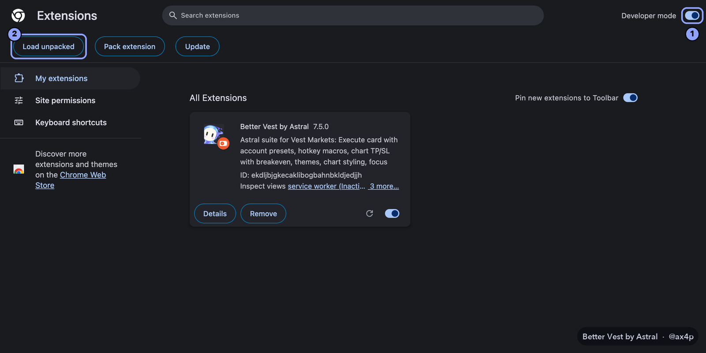
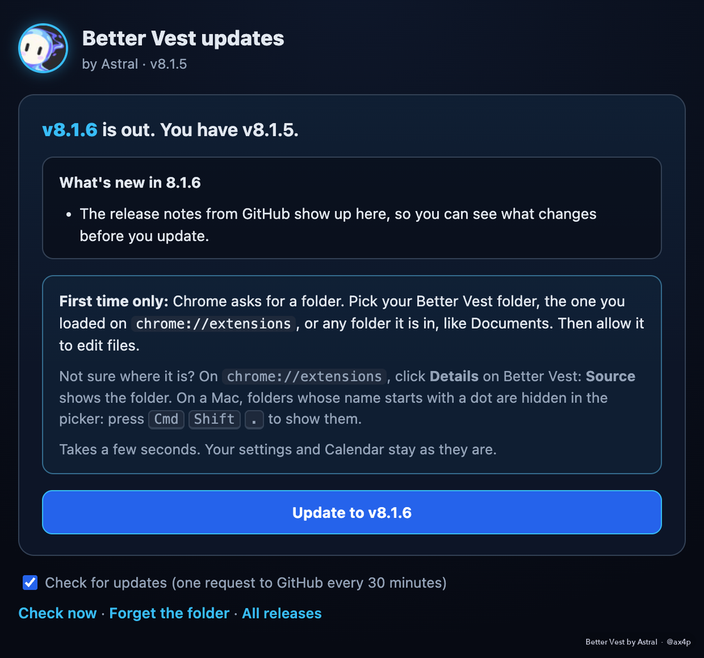

# Installing Better Vest

About two minutes. Works in Chrome, Brave, Edge and Arc on a computer (not on phones).

## Install

1. Download **better-vest-8.0.5.zip** from the [latest release](https://github.com/ax4p/better-vest/releases/latest).
2. Unzip it.
   - **Mac:** double-click the zip.
   - **Windows:** right-click the zip and choose **Extract All**.

   Keep the folder somewhere it can stay, like Documents. Chrome runs the extension from that folder, so don't delete it afterwards.
3. Go to `chrome://extensions` (Brave: `brave://extensions`, Edge: `edge://extensions`).
4. Turn on **Developer mode** in the top right corner, then click **Load unpacked** and pick the `better-vest-8.0.5` folder.
5. Pin it: click the puzzle piece in the toolbar, then the pin next to Better Vest.
6. Open [next.vestmarkets.com](https://next.vestmarkets.com). The dock appears at the top of the page.

When Chrome starts, it may warn you about extensions in developer mode. That's normal for anything installed this way. Click **Keep**.

Leave Developer mode on afterwards. With it off, Chrome switches the extension off the next time it reloads, and an update reloads it.

## Your first trades

Start with your smallest size. Watch the first few orders in Vest's Positions tab, the way you would with any new setup.

## Updating

From 7.4 on, Better Vest updates itself.

1. When a new version is out, an **Update** button shows up in the dock and the toolbar icon says NEW. It checks every 30 minutes, or right away with **Check now** in the toolbar popup.
2. Click it, read what's new, then click **Update**.
3. The first time, Chrome asks for your Better Vest folder. Pick the one you loaded in step 4, or any folder it's in, like Documents, then allow it to edit files. After that it's one click.

Your settings and your Calendar stay as they are.

**Not sure which folder Chrome runs?** On `chrome://extensions`, click **Details** on Better Vest: **Source** shows the folder. On a Mac, folders whose name starts with a dot are hidden in the folder picker. Press **Cmd+Shift+.** to show them, or **Cmd+Shift+G** to paste a path.

**Before it writes anything,** it downloads every file of the new version from this repo and checks them against a list I sign on my own computer. If one file doesn't match, nothing changes. The [Security](SECURITY.md) page has the details.

**Coming from an older version?**

- **7.5.0 or 7.4:** these need the exact folder you loaded, not one above it.
- **7.3:** it can't update itself yet, so do it by hand once:
  1. download the new zip;
  2. unzip it over your old folder (replace the files);
  3. press the round arrow on the Better Vest card in `chrome://extensions`.

## If something's off

- **Nothing shows up on Vest.**
  1. Check that Better Vest is switched on in `chrome://extensions`.
  2. Reload the Vest tab.
  3. If you have another copy installed too (a userscript or a second version of the extension), keep just one on.
- **Better Vest was switched off after an update.** Developer mode is off. Turn it on, then switch Better Vest back on.
- **A group of tabs called "Copy" opened.** That's the copy trader's Turbo mode: one hidden Vest tab per follower account. Leave them open while you copy on Turbo; they close when you switch copying off. On Light there are none.
- **The card shows no position line.** Check that chart TP/SL is on in Settings > Chart, then reload the Vest tab. If the card asks you to pick your account, choose it once in Vest's account menu.

## Removing it

1. On `chrome://extensions`, click **Remove** on Better Vest.
2. Delete the folder.

Your Vest account isn't touched either way.
