

  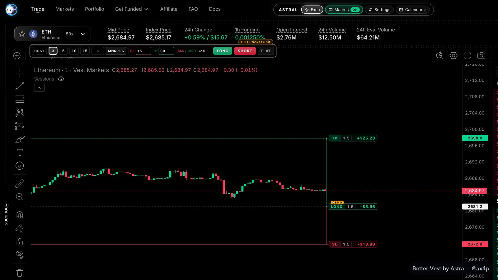

<h1 align="center">Better Vest</h1>

  <b>The trading tools I wanted on Vest, added to the Vest page you already use.</b> 
  A free Chrome extension for <a href="https://next.vestmarkets.com">Vest Markets</a>. By Astral, Discord <b>@ax4p</b>.

  <a href="https://github.com/ax4p/better-vest/releases/latest"><b>Download the latest version</b></a>
  &nbsp;·&nbsp; <a href="CONTRIBUTING.md">Install guide</a>
  &nbsp;·&nbsp; <a href="#is-it-safe">Is it safe?</a>
  &nbsp;·&nbsp; <a href="#is-it-allowed-on-vest">Is it allowed on Vest?</a>

 

Drag your stop and target right on the chart. Trade from a one-click card with your stop, target and risk in dollars. Place stop and limit orders by clicking the chart, cancel them all in one press, trail your stop, copy your trades to your other accounts in groups, see every account's limits at a glance, claim your payouts in one go, and lock yourself out on a bad day. Everything runs in your own browser, on the Vest tab you already have open.

| | |
|---|---|
| **Price** | Free. No sign-up, no subscription, no account with me. |
| **Antivirus** | 0 of 66 engines flag the current zip on VirusTotal. [See the report](https://www.virustotal.com/gui/file/b949d5355c3272b4b9a0c41741051d6598351184499324a6e1ec6194211c8737). |
| **Code** | Every file is in this repo, readable, not minified, and the same as the zip. |
| **Updates** | Signed. A changed file is refused. |
| **Permissions** | `storage`, `alarms` and `tabGroups`. Nothing else. |
| **How it trades** | Through Vest's own ticket, buttons and order code, like you would. No API, no server. |
| **Vest** | Independent. Not made, approved or endorsed by Vest Markets. |

## Contents

- [Is it safe?](#is-it-safe)
- [Is it allowed on Vest?](#is-it-allowed-on-vest)
- [Why I made it](#why-i-made-it)
- [What you get](#what-you-get)
- [The tools](#the-tools): [Execute card](#the-execute-card) · [Stop and limit orders](#stop-and-limit-orders) · [Cancel all orders](#cancel-all-orders) · [TP and SL on the chart](#tp-and-sl-on-the-chart) · [Trailing stop and auto breakeven](#trailing-stop-and-auto-breakeven) · [Copy trader](#copy-trader) · [Daily loss limit](#daily-loss-limit) · [Accounts and limits](#accounts-and-limits) · [Hotkeys](#hotkeys) · [Focus mode](#focus-mode) · [Themes](#themes) · [MNQ view](#mnq-view) · [Calendar](#calendar) · [P&L card](#pl-card) · [Payout certificate and toolbar](#payout-certificate-and-toolbar)
- [How it works](#how-it-works)
- [Install](#install)
- [FAQ](#faq)
- [Support the project](#support-the-project)

## Is it safe?

Anything that sits next to your trading account deserves the question, so here is how to check it without taking my word for it.

**Scan the zip.** The current release, `better-vest-8.2.0.zip`, was scanned on VirusTotal by 66 antivirus engines and none of them flagged it: [VirusTotal report](https://www.virustotal.com/gui/file/b949d5355c3272b4b9a0c41741051d6598351184499324a6e1ec6194211c8737). Its SHA-256 is:

`b949d5355c3272b4b9a0c41741051d6598351184499324a6e1ec6194211c8737`

Check yours with `shasum -a 256 better-vest-8.2.0.zip` on a Mac or `certutil -hashfile better-vest-8.2.0.zip SHA256` on Windows. Same number, same file.

**What it can and can't do:**
- It only runs on next.vestmarkets.com.
- It never sees your password or your wallet's keys, and never stores your Vest login.
- It never withdraws and never changes account settings. The one account action it has is Request payouts, which claims only after you press Claim, through Vest's own Claim profit window.
- It has no server and sends me nothing: no data, no stats, no account details.
- Besides Vest, the only addresses in the code are GitHub (the update check, and the update's files when you click Update) and Google Fonts if you pick a Google font.

**Updates are signed.** Each release lists every file with its hash and signs that list. Your copy checks the signature and every file before it writes anything, so a changed file can't slip in.

The [Security](SECURITY.md) page goes through every permission, every address, how each tool places orders, and how to watch it work in Chrome's DevTools.

## Is it allowed on Vest?

I read Vest's [Terms of Service](https://next.vestmarkets.com/terms) and the [Vest Capital rules](https://docs.vestmarkets.com/vest-capital/overview) before I built this, and I check them again for each release. This is what they say about tools like this one, and what Better Vest does:

- **They don't mention browser extensions, trading tools or copy trading.**
- **The automation they rule out is manipulation.** Under "No Manipulation" the terms forbid using "automated tools, contracts, or bots to artificially inflate or deflate prices or volumes". Better Vest doesn't do that. It places the orders you ask for, at the size you set.
- **API trading isn't available on Vest Capital accounts.** Better Vest doesn't use an API. It works inside Vest's own page, through Vest's own buttons and order code, the same way you would by hand.
- **Vest allows up to 10 live funded accounts per user.** The copy trader copies between your own accounts, under your one Vest login, up to ten followers in each group.

Better Vest is independent. Vest can change its terms at any time, and your account is yours, so read them yourself, especially before you copy trades on funded accounts.

## Why I made it

I trade NQ on Vest every day. The platform is fast and the funded program is good, but a few things kept costing me time. Moving a stop meant opening the ticket and clicking through a confirmation, I couldn't see what a level was worth in dollars, there was no stop order to get in on a break, and I had no way to look back at my days across all my accounts. So I built what I was missing, used it on my own accounts, and I'm sharing it.

## What you get

| Tool | What it does |
|---|---|
| [Execute card](#the-execute-card) | Long or short in one click with your stop and target attached, risk in dollars and R:R before you click, partial take-profits, FLAT, 50% and REV |
| [Stop and limit orders](#stop-and-limit-orders) | Click the chart to place a stop order or a real limit order at that price |
| [Cancel all orders](#cancel-all-orders) | One press cancels every waiting order on the account and leaves your TP, SL and positions alone |
| [TP and SL on the chart](#tp-and-sl-on-the-chart) | Drag them with the dollar amount, the points and the R live, with Undo and a breakeven button |
| [Trailing stop and auto BE](#trailing-stop-and-auto-breakeven) | Your stop follows the price, or jumps to breakeven once you're in profit |
| [Copy trader](#copy-trader) | Trade one account and up to ten others follow it, live, in as many groups as you like |
| [Daily loss limit](#daily-loss-limit) | Locks new trades at your own limit and can close your positions |
| [Accounts and limits](#accounts-and-limits) | Every account's daily loss, max loss and goal at a glance, and your payouts claimed in one go |
| [Hotkeys](#hotkeys) | W, S, E, Q and H for market, limit and breakeven, all remappable |
| [Focus mode](#focus-mode), [themes](#themes), [MNQ view](#mnq-view) | Hide what you don't use, seven themes, NQ shown as MNQ |
| [Calendar](#calendar), [P&L card](#pl-card), [certificate](#payout-certificate-and-toolbar) | Your P&L by day across all accounts, an image or a video of your day to post, your lifetime payouts |

## The tools

### The Execute card

LONG and SHORT in one click, with your stop and target attached to every order. Pick the account size at the top (5K, 10K, 25K or Custom) and the size presets follow it. Next to the size it shows what that means on the market you're on: MNQ on NQ, MES on ES, MGC on gold, shares on stocks, the coin or the currency elsewhere. Before you click, the card shows what the stop and the target are worth in dollars, the R:R, and how much of the account you're risking.

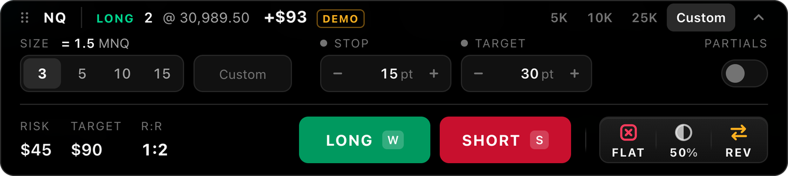

- **Manage the position.** FLAT closes all of it, 50% closes half, and REV closes it and opens the same size the other way, after a second click. They use Vest's own close window, the one its Positions tab opens. FLAT is the panic button: if Vest asks one more question after the close, FLAT confirms it for you.
- **Stop and target in points or dollars.** Each has a **PT | $** switch. In dollars, the points follow your size: a $45 stop is 15 points at size 3 and 4.5 points at size 10. The stop rounds down so you never risk more than you set.
- **Raw orders.** Click **STOP** or **TARGET** above its field to switch it off. With both off, LONG and SHORT send just the size.
- **Partials.** TP1 closes part of the position (half at 20 points, say), **+** adds more targets, up to four, and the rest rides to your target. Right after the fill, Better Vest sets them in Vest's own Edit TP/SL window. **Set on position** does the same for a position you already have.
- **Fold it** into a slim bar when you need the room, and drag it anywhere.

### Stop and limit orders

Vest's ticket has market, limit and scale orders, but no stop order to get in on a break, so the card has one. Press **STOP**, then click the chart: above the price it's a buy stop, below a sell stop, for the size on the card. When the price touches it, it sends a market order through the card, once. Better Vest holds the stop in your tab, so keep the tab open. It never fires on a gap: if the price went past it during a reload, it's marked PASSED and nothing is sent.

**LIMIT** works the same way, but the order is a real limit order on Vest. Press it, then click the chart: below the price a buy limit, above a sell limit. The price snaps to the tick as you aim, one click places it through Vest's own ticket, and a price the market already reached is refused.

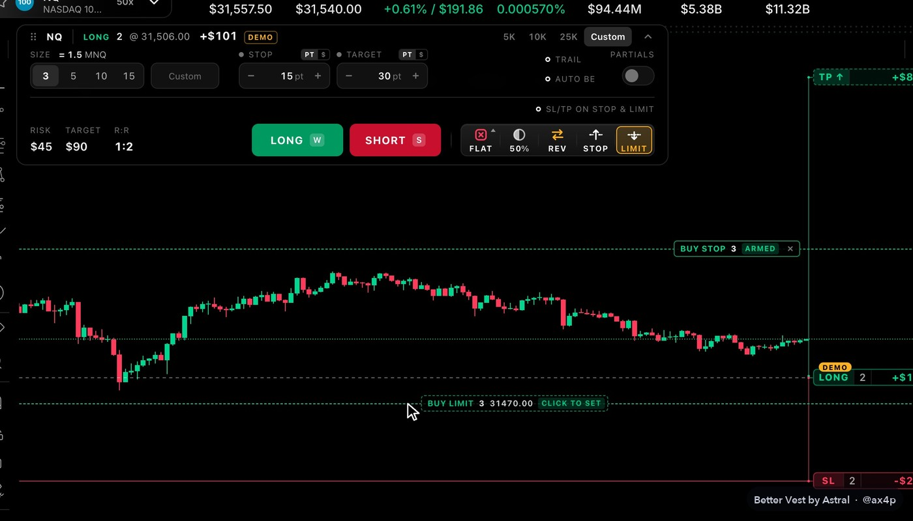

Above the two sits **SL/TP on Stop & Limit**. On, STOP and LIMIT orders carry the card's stop and target. Off, which is the default, they go in plain. The E and Q hotkeys follow the same switch.

### Cancel all orders

Hover FLAT and a **Cancel all orders** button rises above it. One press cancels every order you have waiting on that account, on every market: your stop orders and your limit orders. Your TP and SL stay, and so do your positions. It uses Vest's own Cancel buttons in its Open Orders tab and puts back the tab you had open.

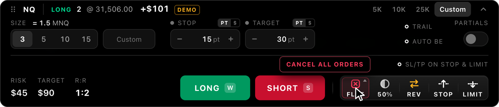

### TP and SL on the chart

Hover your position on the chart and three small buttons appear under it: BE, TP and SL. Grab TP or SL and drag it to the level you want. While you drag, the label shows the dollar amount, the points and the R. Let go and it's set, with no confirmation popup, and Undo is there for five seconds.

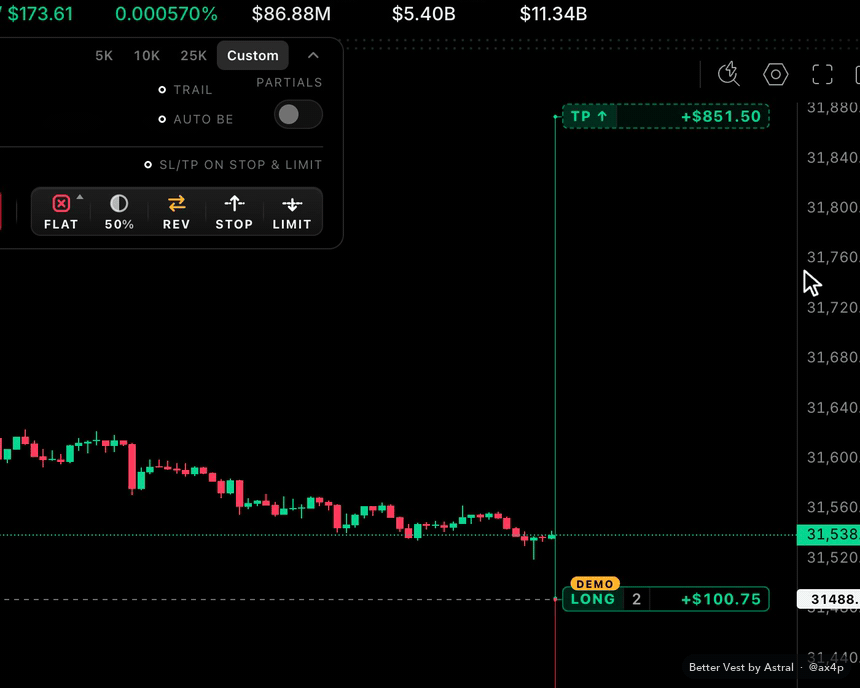

- **Fast.** The labels show up as soon as Vest has your position, and when you get in with the card they're there the moment you press, marked SENDING. A second change right after the first goes straight to Vest.
- **BE** moves your stop to entry plus 5% of the open profit, so a breakeven stop still locks in a little. It never moves a stop backwards.
- The labels sit just right of the latest candle, and the chart keeps room for them while you're in a position. Four label sizes, and it works on a regular or a log price scale.

### Trailing stop and auto breakeven

Two switches on the Execute card, next to Partials.

- **TRAIL** moves your stop up behind the price. Set when it starts (after so many points or dollars in profit) and how far behind the best price it follows, or press **NOW** to start at once. The stop only ever tightens. Drag it back by hand and trailing turns off for that position, so it never fights you.
- **AUTO BE** moves your stop to breakeven once a position is a set number of points or dollars in profit, once per position.

### Copy trader

Trade one account and up to ten of your other Vest accounts follow it, live. Open **Copy** in the dock, pick the leader, switch on the accounts that should follow and give each one a ratio: 1 copies the same size, 0.5 copies half.

Run several of these at once with **groups**: one leader with its own followers per group, say account 3 leading 5, 6 and 7 while account 4 leads 9 and 10. An account copies in one group at a time, and switching it on in another group moves it there. A group whose leader isn't the account in front of you copies from its own Vest tab, which Better Vest opens and keeps awake, and you trade that group there.

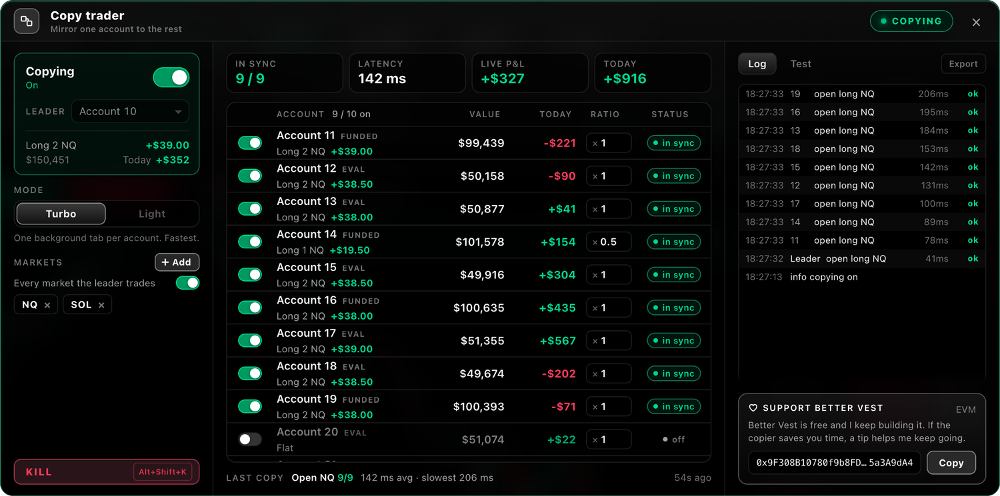

Everything you do on the leader is copied: opening and adding (from the card, Vest's own ticket or the hotkeys), closing part or all of it, every TP and SL including partial targets, and limit orders you leave resting. It copies the moment Vest accepts your order and checks every second, so a follower that drifts is brought back in line.

Rough speeds with nine followers on my own accounts, from Vest accepting your order to the last follower's answer: about 0.35 to 0.45 seconds on Light, about 0.2 to 0.35 seconds with Ultra-fast, and about 0.1 to 0.25 seconds on Turbo with Ultra-fast. Your connection and Vest's load change these.

<b>More about the copy trader</b>

 

- **It doesn't send orders of its own.** It calls Vest's own order code, the same code Vest's ticket and TP/SL windows run, with each follower's account. It never touches your login token.
- **Two speeds.** **Light** (the default) runs everything from your own tab. **Turbo** keeps one hidden Vest tab per follower, grouped and collapsed, so every copy is a single trip to Vest.
- **Ultra-fast** (off by default) sends your opens and adds to the followers the moment your order leaves. If Vest refuses your order, the followers are closed again.
- **Opposite sides.** Vest's rules forbid taking opposite sides of the same market on different funded accounts. So by default a follower sits out a copy that would put it against an account of another group, and your own leader trade gets a heads-up instead. A switch lets you allow it.
- **Markets.** By default it copies every market the leader trades. Switch that off to pick them, and a follower's position on a market that isn't copied is left alone.
- **Sign-in hiccups.** If one follower has a sign-in problem at Vest, it waits and tries again (after 1, 2, 4, then 6 seconds) while the others keep copying.
- **You stay in charge.** The first time, it tells you plainly that it places real orders. Every time you switch it on, it shows what it's about to do first, like "Open NQ-PERP long 2 on 9 followers", and waits for your OK. **Alt+Shift+K** stops copying at once, and pressing it again within five seconds closes the followers' positions. After a reload, copying only comes back by itself when copied positions are still open, and it tells you so.
- Keep the leader's tab open on the trade page, check Vest's rules for your account type before you switch it on, and start small.

### Daily loss limit

Your own limit for the days that go wrong. Turn it on in Settings > Risk and set a dollar amount, and the card shows a line like "Today -$120 of $200", amber from 75%.

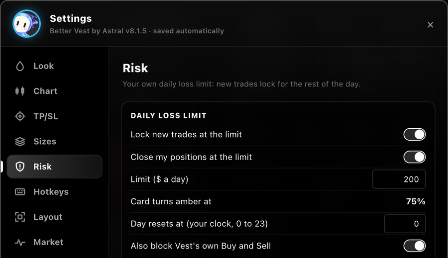

- **At the limit, new trades lock** until the reset hour (midnight unless you change it): LONG, SHORT, REV, LIMIT, the folded bar, the W S E Q hotkeys and Partials. An option locks Vest's own Buy and Sell too.
- **Close my positions at the limit** (on by default) also closes every open position of that account, on every market, through Vest's own Close button the way FLAT does, and keeps you flat until the reset.
- **Getting out is never locked.** FLAT, 50%, BE, dragging TP and SL and Vest's own close buttons always work.
- Today's number is your Account Value now minus the first one it saw after the reset, for each account, read from the page. A deposit, withdrawal or transfer counts too. A lock stays until the reset hour, even through a settings reset. It's separate from any rule Vest has, and it can only act while your Vest tab is open.

### Accounts and limits

Every account in one menu, where Vest's account button was: its value, today, and three bars, how much of today's loss limit is left, the room above your max loss, and how far you are from the profit goal. Amber from half used, red from 80%. Search, filters, pins and nicknames, and a click switches accounts through Vest's own menu.

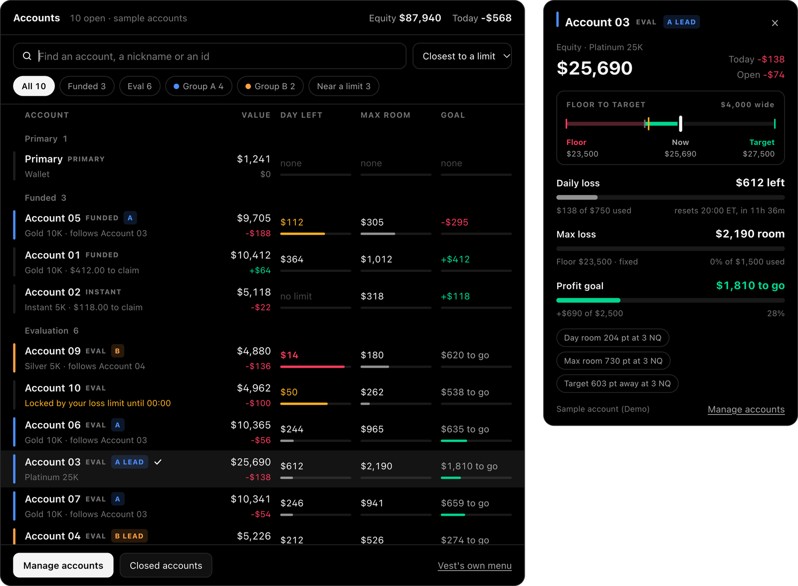

The same three numbers sit in the thin bar under Vest's header. Click them for a panel with the line from your floor to your target, today's loss next to your own limit and Vest's reset, and the room in points at your card's size.

**Request payouts** in Manage accounts claims 100% of what your funded accounts have available, all of them or the ones you pick. It shows what each one would claim and what you receive first, then goes through Vest's own Claim profit window, one account at a time, and brings you back. It stops at the first refusal and tells you why.

Every part has its own switch in Settings > Layout. Off, Vest's own menu and numbers come back as they were.

### Hotkeys

W for long, S for short, E for a limit buy at the best bid, Q for a limit sell at the best ask, and H for breakeven. They're off until you switch them on with Macros in the dock, every key can be remapped, and they never fire while you're typing in a field.

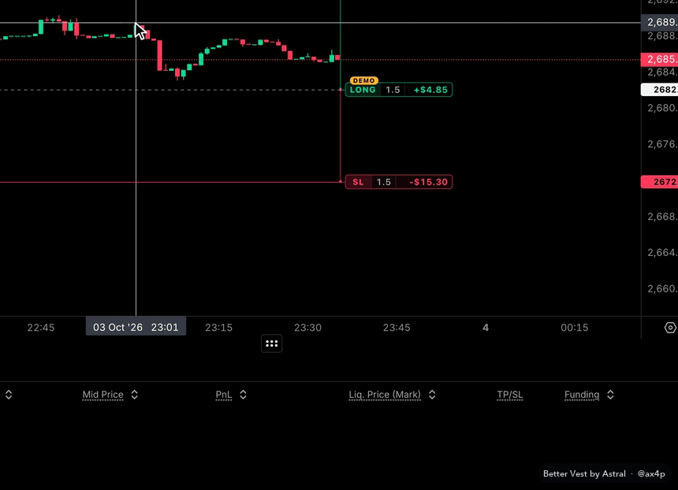

| Keys | What they do |
|---|---|
| W / S | Long / short at market, with the card's size, and its stop and target when they're on |
| E / Q | Limit buy at the best bid / limit sell at the best ask |
| H | Stop to breakeven |
| Alt+F | Focus mode on or off |
| Alt+J | Open the Calendar |
| Alt+Shift+K | Stop the copy trader. Twice within 5 seconds: also close the followers' positions |

The order keys work on NQ and MNQ while the Execute card is showing. E and Q start switched off: turn them on in Settings > Hotkeys.

### Focus mode

Hide the order ticket, the order book, the positions table or the drawing toolbar, and the chart grows into the space. Alt+F switches your whole focus setup on and off.

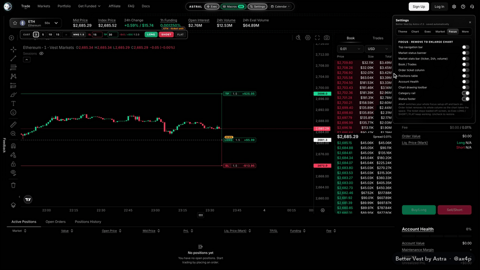

### Themes

Dark, OLED, Astral, Nebula, Ember, Terminal and Light. The whole page follows, candles included.

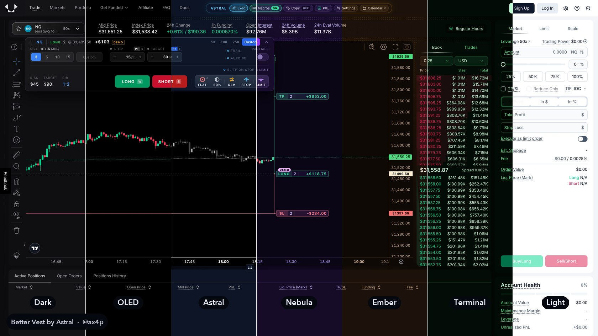

### MNQ view

If you think in micros, Settings > Market > MNQ view shows NQ as MNQ: the sizes on the card, the position on the chart and Vest's own positions, orders and history. Prices and dollars don't change, and Vest still gets NQ.

### Calendar

Every trade from every account as a daily P&L calendar, with win rate, profit factor, average risk in points, reward to risk, max drawdown and all your payouts. It builds itself from your own Vest history in a few seconds and keeps the data on your computer. Open it from the dock or with Alt+J.

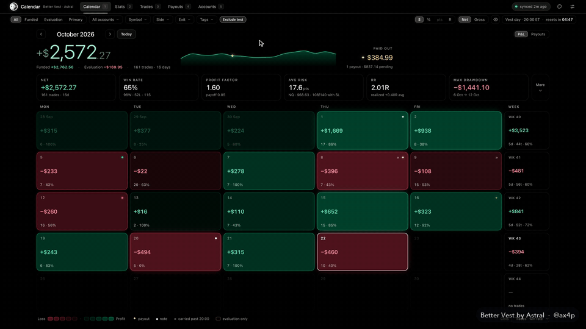

### P&L card

**P&L** in the dock turns your day into an image to post, with Vest's logo on it: one account, several added up, or your whole copy group as a list, in dollars, percent or points. Rows by account, market, copy group, trade or session, for today, yesterday, this week, this month or any day. Dark or light, four styles, four sizes.

**Replay** draws your session on Vest's own candles, every entry and exit where it filled. Style the chart the way you like it: your own chart's candle colors or a preset, candles, hollow, bars, line, area or Heikin Ashi, any timeframe, and the grid, axes, boxes and lines on or off. **Video** plays the day right in the page, and you save it only if you like it.

<table>
  <tr>
    <td width="34%">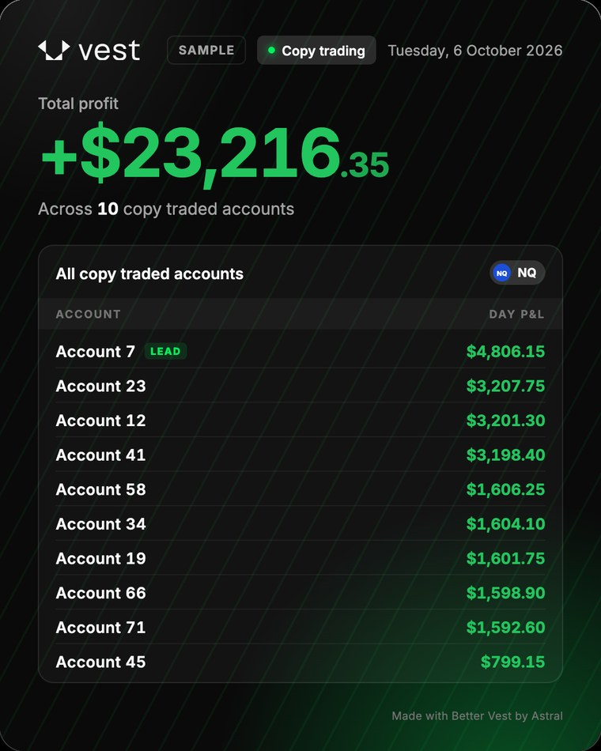</td>
    <td width="66%">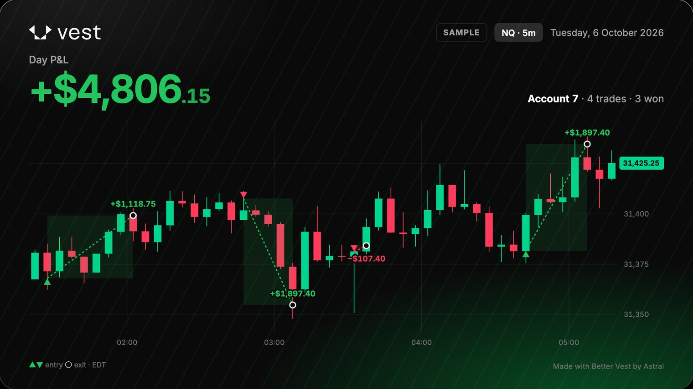</td>
  </tr>
</table>

### Payout certificate and toolbar

When your payouts add up, make a certificate of your lifetime total and save it as an image. The toolbar button shows today, this week and this month without opening anything.

<table>
  <tr>
    <td width="58%">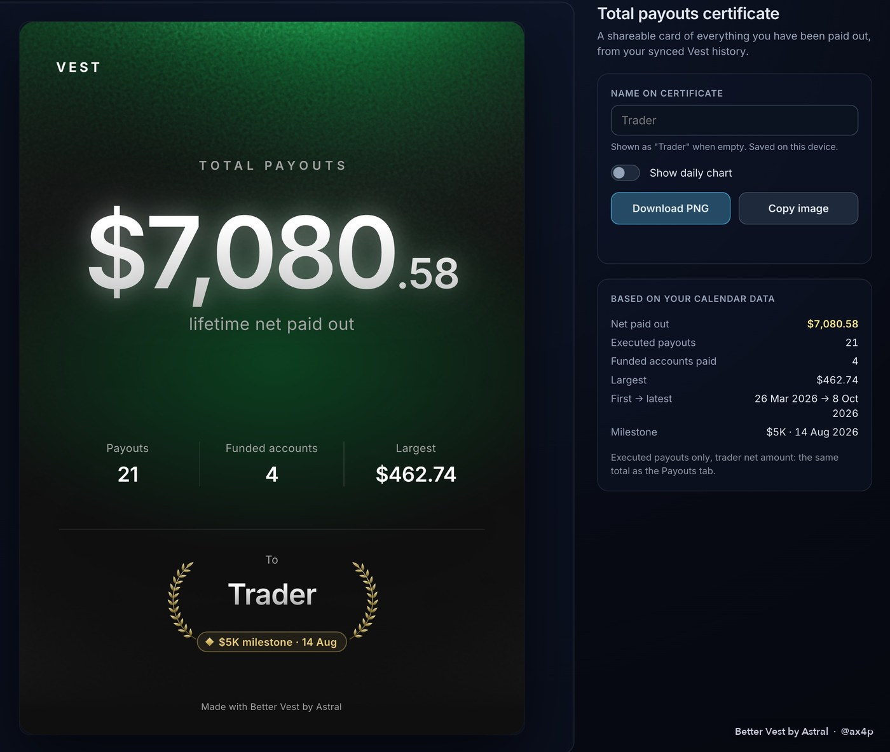</td>
    <td width="42%">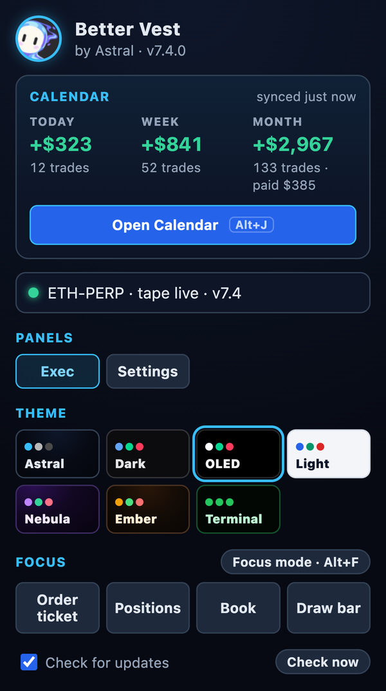</td>
  </tr>
</table>

Every screenshot uses the demo position and sample data in a logged-out browser. No real account is shown.

## How it works

Better Vest only runs on next.vestmarkets.com. When you open Vest it adds its tools to the page: the dock at the top, the Execute card and the labels on the chart.

It doesn't have its own way to trade. When you press LONG, it fills in Vest's own order ticket and presses Vest's own Buy button, the way you would, and a limit order from the chart goes through the same ticket. Moving a TP or SL goes through Vest's own TP/SL handler. FLAT, 50%, REV and Partials use Vest's own windows, and Cancel all orders presses Vest's own Cancel buttons. The account menu switches accounts with Vest's own menu, and Request payouts fills in Vest's own Claim profit window. The copy trader calls the same order code Vest's ticket runs, with each follower's account. Prices come from Vest's public market feed. The Calendar and the P&L card read your history with read-only requests and keep everything on your computer.

There's no server behind it. Updates come from this repo, signed.

## Install

About two minutes in Chrome, Brave, Edge or Arc:

1. Download the zip from the [latest release](https://github.com/ax4p/better-vest/releases/latest).
2. Unzip it.
3. Open `chrome://extensions`, switch on **Developer mode** and click **Load unpacked**, then pick the folder.

Step by step, with screenshots for Mac and Windows, in the [install guide](CONTRIBUTING.md). After that it updates itself: click **Update** in the dock when a new version is out.

It's still a trading tool, so start with your smallest size and watch your first few orders the way you would with any new setup.

## FAQ

**Is this made by Vest?**
No. It's an independent project with no connection to Vest Markets.

**Is it against Vest's terms?**
Vest's terms don't mention browser extensions or trading tools. What they rule out, and why Better Vest doesn't fall under it, is in [Is it allowed on Vest?](#is-it-allowed-on-vest). Read them yourself too, since Vest can change them.

**Does it cost anything?**
No.

**Is it safe?**
It's scanned (0 of 66 on VirusTotal), signed, readable and asks for three permissions. Everything is in [Is it safe?](#is-it-safe) and on the [Security](SECURITY.md) page.

**Does Vest see my stop orders?**
No. Better Vest holds them in your tab and sends a market order when the price gets there, so keep the tab open on the trade page. LIMIT orders are real orders on Vest.

**How many accounts can the copy trader follow?**
One leader and up to ten followers per group, each with its own ratio. You can run several groups.

**Does the copy trader need the tab open?**
Yes. Each group copies from a Vest tab on its leader account. Better Vest opens one for a group whose leader isn't the account in front of you, and keeps it awake while copying is on.

**Does it work on trade.vestmarkets.com?**
No, only on next.vestmarkets.com.

**I installed it and nothing shows up on Vest.**
See the [install guide](CONTRIBUTING.md#if-somethings-off).

**Can I share the zip or post it somewhere else?**
Please share the link to this page instead, so people always get the current version. The details are in the license.

## Support the project

Better Vest is free. If you're buying a Vest evaluation or instant account, use the code **WICK** at checkout. It doesn't cost you anything extra, and it helps keep this going.

On the purchase screens the extension shows a small card with a **Use WICK** button that puts the code in for you. When Vest has filled in its own default code VEST, Better Vest switches it to WICK by itself, where you can see it, and only keeps WICK if it gives the same discount or more. Any other code is never touched. Undo on the card puts VEST back and stops the switch, and Settings > More turns it on or off.

If you'd rather tip, my EVM address is `0x9F308B10780f9b8FD65C6B94071529b75a3A9dA4`. It's in the copy trader too, with a Copy button.

## Credits and rights

Better Vest is designed and built by **Astral** (Discord: **@ax4p**). Not affiliated with Vest Markets.

© 2026 Astral. All rights reserved. You're welcome to install it and use it for your own trading. Redistributing it, selling it, rebranding it or publishing changed versions needs my permission. The full terms are in [LICENSE](LICENSE).

Bugs, ideas or permission requests: Discord **@ax4p**.
