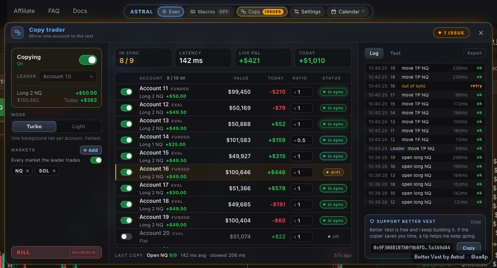

  

# Better Vest

A Chrome extension for [Vest Markets](https://next.vestmarkets.com) with a copy trader for up to ten accounts, your take profit and stop loss on the chart, a one-click order card with partial take-profits, stop orders, a trailing stop, risk in dollars, hotkeys, a focus mode, seven themes, a P&L calendar and a P&L card to share your day.

Made by **Astral** · Discord **@ax4p**

**[Download the latest version](https://github.com/ax4p/better-vest/releases/latest)** · [How to install](CONTRIBUTING.md) · [Is it safe?](SECURITY.md)

## Why I made it

I trade NQ on Vest every day. The platform is fast and the funded program is good, but a few small things kept costing me time. Moving a stop meant opening the ticket and clicking through a confirmation, I couldn't see what a level was worth in dollars, and I had no way to look back at my days across all my accounts. So I built what I was missing. After using it on my own accounts for a while, I'm sharing it.

It all runs in your browser, on the Vest tab you already have open. There's no server, no sign-up and nothing to pay.

## What it does

### Copy trader

Trade one account and up to ten of your other Vest accounts follow it, live. Open it with **Copy** in the dock, pick the leader (the account you trade), switch on the accounts that should follow and give each one a ratio: 1 copies the same size, 0.5 copies half. Then switch copying on.

Everything you do on the leader is copied:
- opening and adding, from the order card, Vest's own ticket or the hotkeys;
- closing part or all of it, FLAT, 50%, REV and Vest's own close buttons;
- every TP and SL, partial targets included. Drag a TP on the chart and the followers' TPs move with it;
- limit orders you leave resting: placed, moved and cancelled the same way on the followers.

It copies the moment Vest accepts your order, and it keeps checking every second, so a follower that drifts (a close on Vest's side, a stop that filled, a trade from your phone) is brought back in line.

All your accounts show up by themselves, with their balance and today's P&L: switch on the ones that should follow. Each follower shows its position and live P&L, with the total next to it. A slim bar under the dock shows every account at a glance: in sync, catching up, or paused with the reason.

By default it copies every market the leader trades. Switch that off and pick the markets yourself. A follower's position on a market that isn't copied is left alone, so you can still trade something by hand on a follower.

It doesn't send orders of its own. It calls Vest's own order code, the same code Vest's order ticket and TP/SL windows run, with each follower's account, and Vest does the rest. It never touches your login token.

Two speeds:
- **Light** (the default) runs everything from your own tab, with no extra tabs.
- **Turbo** keeps one hidden Vest tab per follower, grouped and collapsed, each set to its own account, so every copy is a single trip to Vest. Keep those tabs open while you copy.

**Ultra-fast** is a switch under the mode, off by default. Your opens and adds go out to the followers the moment your order leaves, about one round trip sooner. If Vest refuses your order, the followers are closed again.

Rough speeds with nine followers on my own accounts, from Vest accepting your order to the last follower's answer: about 0.35 to 0.45 seconds on Light, about 0.2 to 0.35 seconds with Ultra-fast, and about 0.1 to 0.25 seconds on Turbo with Ultra-fast. Your connection and Vest's load change these.

If one follower has a sign-in problem at Vest, it waits a moment and tries again (after 1, 2, 4, then 6 seconds) while the others keep copying.

You stay in charge:
- The first time, it tells you plainly that it places real orders.
- Every time you switch it on, it shows what it's about to do first, like "Open NQ-PERP long 2 on 9 followers", and waits for your OK.
- **Alt+Shift+K** stops copying at once. Press it again within five seconds to close the followers' positions. The leader stays as it is.
- After a reload, copying only comes back by itself when copied positions are still open, and it tells you so. Otherwise it stays off.

Keep the leader's tab open on the trade page. Copy trading may not be allowed on every account, so check Vest's rules for yours before you switch it on, and start small.

### TP and SL on the chart

Hover your position on the chart and three small buttons appear under it: BE, TP and SL. Grab TP or SL and drag it to the level you want. While you drag, the label shows the dollar amount, the points and the R. Let go and it's set, with no confirmation popup. If you change your mind, Undo is there for five seconds.

BE moves your stop to entry plus 5% of the open profit, so a breakeven stop still locks in a little. You can change that in Settings. It never moves a stop backwards.

The labels sit just right of the latest candle. While you're in a position, the chart keeps enough room there for them, and gives it back when you're flat. Scroll back into history and they wait at the right edge. Settings > TP/SL has four label sizes, and it works on a regular or a log price scale.

### The Execute card

LONG and SHORT in one click, with your stop and target attached to every order, unless you switch one off (below). Pick the account at the top (5K, 10K, 25K or Custom) and the size presets follow it. Next to the size it shows what that means on the market you're on: MNQ on NQ, MES on ES, MGC on gold, shares on stocks, the coin or the currency elsewhere. Before you click, the card shows what the stop and the target are worth in dollars, the R:R, and how much of the account you're risking.

When you're in a position, it sits at the top of the card with its live P&L, and three buttons manage it. FLAT closes all of it. 50% closes half. REV closes it and opens the same size the other way, with the card's stop and target. It asks for a second click first, and it only opens the new side once Vest shows the old one closed. All three use Vest's own close window, the one the Close button in its Positions tab opens. If another tab of Vest's bottom panel is open, they switch it to Active Positions first. REV works on NQ and MNQ, like the order hotkeys.

FLAT is the panic button. It closes the position on the chart you're looking at, and if Vest asks one more question after the close (slippage, your account limits, or close orders already waiting), FLAT confirms it for you.

Sometimes you want a raw order. Click **STOP** or **TARGET** above its field to switch it off. The dot goes hollow and the field dims. Switch both off and LONG or SHORT sends just the size, no stop and no target, and the card shows "No stop" and "-" for the R:R. With one off, the order gets only the other one. It remembers your choice, the folded bar shows it too, and the hotkeys and REV follow the same switches. Partials need a target, so they switch off with it.

The stop and the target can be set in points or in dollars. Each has a **PT | $** switch above it. In dollars, the points follow your size: a $45 stop is 15 points at size 3 and 4.5 points at size 10. The stop rounds down so you never risk more than you set, the target rounds up, and RISK shows the real dollars.

When you need the room, fold the card into a slim bar. Drag it anywhere.

Turn on **Partials** to scale out. TP1 closes part of the position (half at 20 points, say), **+** adds more targets (up to four), and the rest rides to your target. Every target shows what it's worth in dollars while you type. Right after the fill, Better Vest sets them all in Vest's own Edit TP/SL window, the same one you'd use by hand, and your stop stays as it is. **Set on position** does the same for a position you already have. Like 50% and REV, it works through Vest's Positions tab, and brings that tab up if it isn't showing.

### Stop orders

Vest's ticket has market, limit and scale orders, but no stop order to get in on a break, so the card has one. Press **STOP** next to REV, then click the chart where it goes: above the price it's a buy stop, below a sell stop, for the size on the card. When the price touches it, it sends a market order through the card, with your stop and target, once.

Better Vest holds the stop in your tab, so Vest never sees it until it fires, and it only works while the tab is open with a live price. It shows on the chart as a dashed line with its price on the scale. Drag it to move it, and the x removes it. It never fires on a gap: if the price went past it during a reload or an outage, it's marked PASSED and nothing is sent. Click it to arm it again.

### Trailing stop and auto breakeven

Two switches on the Execute card, next to Partials.

**TRAIL** moves your stop up behind the price. Set when it starts (after so many points or dollars in profit) and how far behind the best price it follows, or press **NOW** to start at once. Turning it on arms the position on the chart and every new one. The stop only ever tightens, in steps of a point or more, and it goes through the same TP/SL handler as dragging it yourself. Drag the stop back by hand and trailing turns off for that position, so it never fights you.

**AUTO BE** moves your stop to breakeven once a position is a set number of points or dollars in profit, once per position, by the same rule as the BE button.

### MNQ view

If you think in micros, Settings > Market > MNQ view shows NQ as MNQ: the sizes on the card, the position on the chart and Vest's own positions, orders and history read in MNQ, with an MNQ VIEW badge on the market. Prices and dollars don't change. It's display only: Vest still gets NQ.

### Daily loss limit

A soft lock for the days that go wrong. Turn it on in Settings > Risk, set a dollar limit (200 to start), and the card shows a small line like "Today -$120 of $200". It turns amber at 75%. At 100% new trades are locked until the reset hour (midnight unless you change it): LONG, SHORT, REV, the folded bar, the W S E Q hotkeys and Partials. FLAT, 50%, BE, dragging TP and SL on the chart and Vest's own close buttons always keep working, because cutting risk should never be locked. There's an option to lock Vest's own Buy and Sell too. Today's number is your Account Value now minus the first one it saw after the reset, kept for each account, read from the page you're looking at. Nothing is requested from Vest. It's your own limit, separate from any rule Vest has. A deposit, withdrawal or transfer moves the Account Value, so it counts as profit or loss. A lock stays until the reset hour, even if you reset or import your settings. Until the card is reading your Account Value it says "limit not active", and nothing is locked. It's a lock on your screen, so it can't stop an order that comes from somewhere else.

### Hotkeys

W for long, S for short, E for a limit buy at the best bid, Q for a limit sell at the best ask, and H for breakeven. They're off until you switch them on with the Macros button in the dock, and every key can be remapped in Settings. They never fire while you're typing in a field, and they don't open TradingView's symbol search.

### Focus mode

Hide the order ticket, the order book, the positions table or the drawing toolbar, and the chart grows into the space. Alt+F switches your whole focus setup on and off.

### Themes

Dark, OLED, Astral, Nebula, Ember, Terminal and Light. The whole page follows, candles included.

### Calendar

Every trade from every account, laid out as a daily P&L calendar. Next to it: win rate, profit factor, average risk in points, reward to risk, max drawdown and all your payouts. It builds itself from your own Vest history in a few seconds and keeps the data on your computer. Open it from the dock or with Alt+J.

### Payout certificate and toolbar summary

When your payouts add up, open the Portfolio page and make a certificate of your lifetime total, then save it as an image. The toolbar button shows how today, this week and this month are going without opening anything.

<table>
  <tr>
    <td width="66%"></td>
    <td width="34%"></td>
  </tr>
</table>

### P&L card

**P&L** in the dock turns today's P&L into an image to post, with Vest's logo on it. Pick one account, several added up, or your whole copy group as a list, one row per account. You choose what shows: only the green accounts, names hidden, dollars or percent, the date, your name. Dark or light, four styles, and four sizes (4:5, 1:1, 16:9 for X, 9:16 for a story). Then **Download PNG** or **Copy image** and paste it into your post.

**Replay** draws your session on Vest's own candles: every entry and exit where it filled, and each trade's P&L. Pick which trades go on the card and drag the time range, and the total counts only what's shown.

The numbers are Vest's own: each account's day is its value now minus its value at Vest's daily reset. After a winning exit worth 1% or more of the account, the P&L icon glows green for a while, so you know it's a good moment to post.

<table>
  <tr>
    <td width="34%"></td>
    <td width="66%"></td>
  </tr>
</table>

The screenshots use a test position and sample data. No real account is shown.

### Shortcuts

| Keys | What they do |
|---|---|
| W / S | Long / short at market, with the card's size, and its stop and target when they're on |
| E / Q | Limit buy at the best bid / limit sell at the best ask |
| H | Stop to breakeven |
| Alt+F | Focus mode on or off |
| Alt+J | Open the Calendar |
| Alt+Shift+K | Stop the copy trader. Twice within 5 seconds: also close the followers' positions |

The order keys work on NQ and MNQ while the Execute card is showing. E and Q start switched off: turn them on in Settings > Hotkeys. They also need chart TP/SL to be on.

## How it works

Better Vest is a Chrome extension. It only runs on next.vestmarkets.com, and when you open Vest it adds its tools to the page you already use: the dock at the top, the Execute card and the labels on the chart.

It doesn't have its own way to trade. When you press LONG, it fills in Vest's own order ticket and presses Vest's own Buy button, the way you would. Moving a TP or SL on the chart goes through Vest's own TP/SL handler, and FLAT, 50%, REV and Partials use Vest's own windows. The copy trader calls the same order code Vest's ticket and windows run, with each follower's account, so Vest's own code sends every copied order. A stop order, when it fires, goes through the card the same way. Prices come from Vest's public market feed. The Calendar reads your trade history from Vest with read-only requests and keeps it on your computer, and the P&L card reads today's positions the same way and makes the image in your browser.

There's no server behind it and nothing about you goes to me. Updates come from this repo and are signed, so a changed file can't slip in. The [Security](SECURITY.md) page lists every address it talks to and shows how to check all of it yourself, including an antivirus scan of the zip.

## Install

About two minutes in Chrome, Brave, Edge or Arc:
1. Download the zip.
2. Unzip it.
3. Load the folder on `chrome://extensions` with Developer mode on.

Step by step, with screenshots, in the [install guide](CONTRIBUTING.md).

It's still a trading tool, so start with your smallest size and watch your first few orders the way you would with any new setup.

## FAQ

**Is this made by Vest?**
No. It's an independent project and has no connection to Vest Markets.

**Does it cost anything?**
No.

**Is it safe?**
It only runs on Vest and asks Chrome for three permissions. It places orders through Vest's own buttons and Vest's own order code, and never touches your password, your wallet or your withdrawals. Everything is explained, with ways to check it yourself, on the [Security](SECURITY.md) page.

**How many accounts can the copy trader follow?**
One leader and up to ten followers, each with its own ratio.

**Is copy trading allowed on my accounts?**
That's up to Vest's rules for your account type. Check them before you switch it on.

**Does Vest see my stop orders?**
No. Better Vest holds them in your tab and sends a market order when the price gets there, so keep the tab open on the trade page.

**Does the copy trader need the tab open?**
Yes. Copying runs in the Vest tab that's on the leader account, so keep it open on the trade page. It keeps that tab awake while copying is on.

**Does it work on trade.vestmarkets.com?**
No, only on next.vestmarkets.com.

**I installed it and nothing shows up on Vest.**
See the [install guide](CONTRIBUTING.md#if-somethings-off).

**Can I share the zip or post it somewhere else?**
Please share the link to this page instead, so people always get the current version. The details are in the license.

## Support the project

Better Vest is free. If you're buying a Vest evaluation or instant account, use the code **WICK** at checkout. It doesn't cost you anything extra, and it helps keep this going.

On the purchase screens the extension shows a small card with a **Use WICK** button that puts the code in for you. When Vest has filled in its own default code VEST, Better Vest switches it to WICK by itself, where you can see it, and only keeps WICK if it gives the same discount or more. Any other code is never touched. Undo on the card puts VEST back and stops the switch, and Settings > More turns it on or off.

If you'd rather tip, my EVM address is `0x9F308B10780f9b8FD65C6B94071529b75a3A9dA4`. It's in the copy trader too, with a Copy button.

## Credits and rights

Better Vest is designed and built by **Astral** (Discord: **@ax4p**).

© 2026 Astral. All rights reserved. You're welcome to install it and use it for your own trading. Redistributing it, selling it, rebranding it or publishing changed versions needs my permission. The full terms are in [LICENSE](LICENSE).

Bugs, ideas or permission requests: Discord **@ax4p**.
